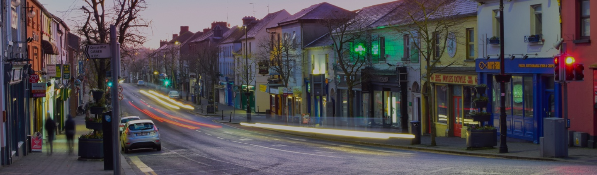

1. [About this website](#About)
2. [Goals](#project-goals)
    1. [User Goals](#user-goals)
    2. [Site Owner Goals](#site-owner-goals)
3. [User Experience](#user-experience)
    1. [Target Audience](#target-audience)
    2. [User Requrements and Expectations](#user-requrements-and-expectations)
4. [Design](#Design)
    1. [Design Choices](#design-choices)
    2. [Color Scheme](#color-scheme)
    3. [Fonts](#fonts)
    4. [Images and Video](#images-and-video)
    5. [Structure](#structure)
    6. [Wireframes](#wireframes)
4. [Technologies Used](#technologies-used)
    1. [Languages](#languages)
    2. [Frameworks & Tools](#frameworks--tools)
5. [Features](#features)
    1. [Logo and Navigation Bar](#logo-and-navigation-bar)
    2. [Footer](#footer)
    3. [Homepage](#homepage)
    4. [About Us](#about-us)
    5. [Our Animals](#our-animals)
    6. [Fundraising](#fundraising)
    7. [Contact Form](#contact-form)
    8. [Map and address](#map-and-address)
6. [Development](#development)
    1. [Building and Maintaining](#building-and-maintaining)
    2. [Commits](#commits)
    3. [Deployment](#deployment)
    4. [Cloning](#cloning)
7. [Testing](#testing)
    1. [HTML Validation](#html-validation)
    2. [CSS Validation](#css-validation)
    3. [Accessibility](#accessibility)
    4. [Performance](#performance)
    5. [Responsiveness](#responsiveness)
    6. [Browser compatibility](#browser-compatability)
    7. [Testing user stories](#testing-user-stories)
8. [Bugs](#Bugs)
9. [Credits](#credits)
10. [Acknowledgements](#acknowledgements)

## About
Devhaus is a software development company based in Gorey Co. Wexford. It was founded in 2013 and directed by Joanne O'Grady and David Bolger. Our business model focuses on being client centered and producing robust software solutions that work well for our client's businesses. 

We pride ourselves on building positive, long standing relationships with our clients many of whom we continue to work with after many years together. 

This shared trust allows us to build the hardworking, complex, useful software that is our passion. 

## Project Goals

### User Goals
The aim of this webiste is to provide the user with information about the software development company, Devhaus, that is clear and easy to access. The user will learn about the company's location, capabilities and service offering. They will be able to review projects that have been developed by Devhaus by clicking on the relevant links on the home page. 

The user will easily be able to contact Devhaus via the Contact Us form.

### Site Owner Goals
The goal of the site for the owner is to have a professional, clean and informative website that will impress visitors to the site at first glance, will provide them with easy to understand and accessible information on the company's achievements and software services. Overall, the website will act as a shop window, laying out the company's wares. 

The website is clear and easy to read and the flow of information is logical. Calls to action are placed in the header, main body and footer of the site to assist the user with straightforward navigation. The overall design and content of the site will build confidence in the user and they will gain a comprehensive understanding of the company's business. 

## User Experience

### Target Audience
The target audience are individuals who want to have software built usually to support or improve their current business processes. They may visit the site via links on a search engine results page, through advertising, social media or from a back link on some online press coverage. They may be at the early idea stage or have more particular requirements already thought out, the website will assure the user that whatever point they're at in their journey, we're here to support them. 

### User Requrements and Expectations

A clear, informative and easy to navigate interface
- Links and functionality that work as they would expect
- An easy-to-find means of contacting the company
- Accessibility

## Design
The current Devhaus website was built a number of years ago and the company has evolved from this point to the stage where the website is not in line with the current ethos and offerings of the company. 

Working with a Co. Wexford based designer in 2021, a new design was conceived to bring the site up to date and convey a sense of modernity and professionalisim in line with the company's current capabitities. 

### Design Choices

The website design is a juxtaposition of strong accent colours with bold graphics based on the Devhaus branding and the use of white space which gives structure and clarity ensuring the content is easy to navigate, read and access. 
   
The calls to action stand out and attract the eye, encouraging the user to make a particular user journey to the contact us page. 

## Color Scheme
The color scheme is based around the orange devhaus branding and accented by a midnight blue. This creates the basis of the striking graphic imagery created by the designer for the site. White text is easily readable over these colours. 

The striking colours and graphics grab the users attention, creating an edgy, modern yet slick and professional feel. 

A light blue gradient background is used in two sections to further define particular areas of the website, these are the 'our Process' section and the 'Find us here' section of the Contact Us page. 

The gradient is subtle and it is used as a visual cue to define these particular areas without distracting the user from the content. 

<!-- - Final palette colours that were chosen were #F4F9F4 #C4E3CB #8AAE92 #616161 -->

## Fonts
The font chosen for this website is Quicksand. Quicksand is a very legible, modern font based on geometric shapes with rounded terminals. 

The font reflects the modern, edgy look and feel that the website aims to deliver. 

### Images 

The image on the Contact Us page shows the location of Devhaus' physical office in Gorey, Co. Wexford and this image is owned by the developer. 

### Structure

The structure of the website pages are intuitive and familiar and is user friendly and easily navigable. 

On the landing page, the user immediately sees the naviagtion bar and it is clear to see how the site can be used. 
    
The website consists of three separate pages: 
- A homepage with relevant company information, a high level explanation of our process, links to examples of completed work and calls to action to make an enquiry/contact the team. 
- A Services page outlining the various software development services and support offered.
- A contact page with a contact form, email and postal address and a contact phone number. 

## Wireframes
I based the design of this website on a wireframe PSD supplied by the designer. 

For the purposes of this project, the design has not been fully implemented, rather I have taken what I required from it to meet the criteria of this project for the Code Institute purposes and what I felt would demonstrate my competency for the HTML/CSS basics module. 

<!-- add in carolines designs here.  -->

## Features
The three individual pages contain the following features:

### Logo and Navigation Bar

The navigation menu bar appears consistently across the three pages and includes the Home, Services and Contact Us links.

It overlays the header image and has two design types. 

On the homepage and Contact Us page the font colour for the links are white as the header images on these pages are dark blue/navy. 

On the services page, the header image is white and the links are navy. 

In both cases, the page the user is currently navigating will be highlighted orange in the menu nav bar. 

### Footer
The design of the footer is consistent across all pages and comprises two areas:
- The primary area of real estate which contains a striking, 'neon lights' style image and a call to action button encouraging the user to get in contact with Devhaus to discuss their potential software projects and ideas.

- The sub footer with contact email (clickable), Phone number (clickable), office location address as well as links to social media, i.e. Facebook, Twiter and Linkedin. 

### Homepage
The landing page creates an immediate impact with a striking header graphic image and a clear, precise statement which delivers the message of what Devhaus does quickly. 

The aim of the homepage overall is to build confidence in the user that Devhaus are a professional, skilled and diverse team of software developers, encompassing the user's full journey from idea inception and launch - and everything in between. 

In combination with the striking graphics and colour scheme, the content delivers clear and helpful information. 

An 'Awards' banner has been included in the design, showcasing a project which was the overall winner of the PProject Management Institute Awards in 2021. This again inspires confidence in the user that they are dealing with a professional, reputable company.

### Services page

The Services page is a cleanly designed page combining graphic images and text on a white background creating an easy to read program of services offered by Devhaus. 

The header text statement sums up our mission: *Custom software solutions to streamline your business operations*

The subsequent paragraphs outline the software services available to potential clients. 

The Technology Stack section of the Services Page describes the specialised range of technologies used by our team to create custom software. 

### Contact us

The contact page is engaging with a vivid background header image and a clear, easy to read form to contact the company.

This page contains further useful contact information including the physical office location, contact email address, support email address for current clients and a contact phone number. 

## Technologies Used

### Languages
- HTML
- CSS

### Frameworks & Tools
- Git
- GitHub
- Gitpod
- Google Fonts
- cssgradient.io/

## Development 

### Building and Maintaining

GitHub was used as version control software to maintain, upload and share code with other developers.

GitPod was used to write the code.

### Commits

Updates were regularly made via commits in Gitpod. 

Terminal Commands
* git add .
* git commit -m "Description of change"
* git push
* git status 

### Deployment

The following steps were taken to deploy the website to GitHub Pages: 

### **To deploy the project**
The site was deployed to GitHub pages. The steps to deploy a site are as follows:
  1. In the GitHub repository, navigate to the **Settings** tab.
  2. Once in Settings, navigate to the **Pages** tab on the left hand side.
  3. Under **Source**, select the branch to **master**, then click **save**.
  4. Once the master branch has been selected, the page will be automatically refreshed with a detailed ribbon display to indicate the successful deployment.image

  <!-- readme-deployment -->

### Cloning

1. Navigate to repo: https://github.com/kkerswell/CI_PP1_AnimalCharity
2. Click on the 'Code' button
3. Copy the repository url
4. Navigate to your personal GitHub page
5. Click on the 'Repositories' link at the top of the page
6. Click on the 'New' button
7. Click on 'Import a repository' at the top of the page
8. Pase the repository url from above
9. Name your new repository
10. Click 'Begin Import'

## Testing

### HTML Validation

The code for this website was validated using W3 validatiors for HTML and CSS. The following issues were identified and fixes applied as per the solutions. 

https://validator.w3.org/ was used to validate HTML.

#### index.html
**Error:** Statement h3 not allowed as child of element span in this context. (Suppressing further errors from this subtree.)
**Solution:** Change span to div.

**Error:** An img element must have an alt attribute, except under certain conditions. For details, consult guidance on providing text alternatives for images.
**Solution:** alt attribute added to the image to resolve this error. 

**Error:** Attribute alt not allowed on element a at this point.
**Solution:** I removed the alt attribute which caused the error.

**Error:** No p element in scope but a p end tag seen.
**Solution:** I had placed a h tag withing the p tag. This caused the error and removing the p tag resolved the issue. 

## services.html
**Error:** An img element must have an alt attribute, except under certain conditions.
**Solution:** alt attribute added to the image to resolve this error.

**Error:** No p element in scope but a p end tag seen.
**Solution:** I had placed a h tag withing the p tag. This caused the error and removing the p tag resolved the issue. 

## contact.html
No errors

### CSS validation

https://jigsaw.w3.org/css-validator/ was uset to validate CSS

**1 Error found:**
File not found: https://fonts.googleapis.com/css2?family=Quicksand:wght@300;400,600&display=swap: Bad Request
**Solution:** I identified an error in the @import code which when corrected, imported the google font 'Quicksand' correctly

### Testing

The website is tested for correct rendering and responsiveness and to ensure that all links and functionality work as expected on a number of viewport widths including

- 320px
- 375px
- 768px
- 1140px

and on the following browsers:
- Chrome
- Safari
- Firefox
- Microsoft Edge

